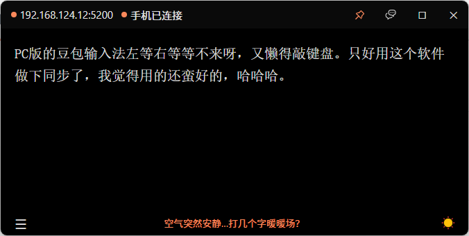

# SyncInput

局域网内电脑和手机之间的实时同步输入框。支持文字和图片的双向同步。

## 运行

双击 `syncinput.exe`，手机连同一 WiFi 后扫描二维码或浏览器访问显示的 IP 地址即可连接。

## 截图

## 致谢

- 应用图标：箭头 方向 旋转 同步图标 by Colourcreatype on [Icon-Icons.com](https://icon-icons.com/zh/authors/1173-colourcreatype)
- 图钉图标 by Ant design on [Icon-Icons.com](https://icon-icons.com/zh/authors/1350-ant-design)
- 月亮图标：天气预报 月 晚的天空图标 by icon lauk on [Icon-Icons.com](https://icon-icons.com/zh/authors/671-icon-lauk)
- 太阳图标：天气预报 热的太阳 天图标 by icon lauk on [Icon-Icons.com](https://icon-icons.com/zh/authors/671-icon-lauk)
- 聊天图标：气囊 聊天室 对话 讲话图标 by Icon-Icons (Carlos) on [Icon-Icons.com](https://icon-icons.com/zh/authors/115-icon-icons-carlos)
